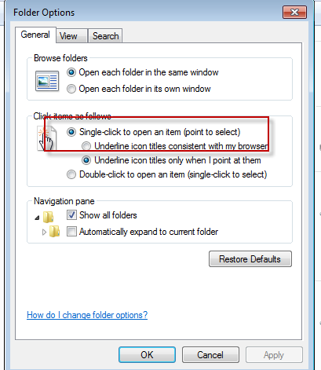

# Windows Setup

This is my basic setup for Windows 7 at work. Unfortunately, I am forced to use Windows
due to enterprisey standards and licensing agreements. But thanks to open source software,
I can make it a tolerable experience. Here's how I do it. 

When we finally move to Windows 10, a lot of this might be unnecessary if I can successfully
use with Windows Subsystem for Linux but I've never done that so I don't know. More to come
on that.

## Home Directory

By default, you have a Windows home directory of C:\Users\<userid>. That is fine and 
you can use that as your home if you'd like. However, I get a little paranoid with
Windows and I kind of want to control things myself and keep it crud free. So I create
a directory name C:\home\<userid> and set the HOME environment variable to this directory.

It keeps the stuff I intentionally install and work on separate from the Windows home
that's filled with all kinds of other crap I don't care about.


## Tools to install first

* Git - https://git-scm.com/downloads
* wget for Windows - https://eternallybored.org/misc/wget/1.19.4/64/wget.exe
* [Emacs](https://www.gnu.org/software/emacs/download.html) for Windows

https://github.com/git-for-windows/git/releases/download/v2.18.0.windows.1/Git-2.18.0-64-bit.exe

## Turn on Single Click

> I've stopped doing this. Now in Double click mode. 

If you are coming from a Mac, going back to double clicking on things is maddening. 
Turn on single click and it feels more natural.

* Open Windows Explorer
* From the menu, Tools > Folder Options
* Select "Single Click on item to open"




## Turn on Natural Scrolling

Again, coming from a Mac, the direction of the mouse wheel is backwards on Windows.
Fix it by following these instructions: https://www.vvse.com/blog/blog/2012/02/27/reverse-scrolling-on-windows-7/


## Remapping the Caps Lock to Ctrl

As an Emacs user, I make heavy use of the Ctrl key. It's unnatural where it is
so I remap it to the Caps Lock key. Some people like remapping Ctrl to Caps Lock
but I find there is no real need for a Caps Lock key.

### Pok3r Remap of Caps Lock

For my keyboard of choice, [the Vortex Pok3r](https://www.amazon.com/Mechanical-Keyboard-Keycaps-Cherry-Mx-Blue/dp/B00OFM51L2/), you can do the remap by programming
one of the non-default layers. The default layer is not programmable.

To reprogram the CapsLock on Layer 2:

* FN + R_Ctrl to enter programming mode -> second LED under space bar is now lit
* CapsLock then: L_Ctrl then: PN to confirm
* FN + CapsLock then: L_Ctrl then: PN to confirm
* FN + R_Ctrl to exit programming -> second LED extinguishes

This works great if I am sitting at my desk typing on my Pok3r. However, I often
have to undock my laptop and work off the laptop keyboard. In this case, I need
to have the Caps Lock remapped at the Windows level.

### Windows 7 Remap of Caps Lock

* Run regedit.exe
* 
* Drill down to [HKEY_LOCAL_MACHINE\SYSTEM\CurrentControlSet\Control\Keyboard Layout]
* Add a new Binary value here named "Scancode Map"
* Set the value of Scancode Map to:

```
00 00 00 00 00 00 00 00
02 00 00 00 1d 00 3a 00
00 00 00 00
```

If you really want to swap Caps Lock and Left Ctrl, set the Scancode Map to:

```
00 00 00 00 00 00 00 00
03 00 00 00 1d 00 3a 00
3a 00 1d 00 00 00 00 00
```

## Fonts

I am always playing around with fonts but I've settled on Hack as my
favorite font for terminal and text editor. You can download it from:

https://sourcefoundry.org/hack/

Formerly, I liked Inconsolata which is still a great font. Download it from 
the official Github repo at https://github.com/google/fonts/tree/master/ofl/inconsolata.

## Essential applications

* [wget](https://eternallybored.org/misc/wget/1.19.4/64/wget.exe)
* [cURL](https://curl.haxx.se/download.html)
* [DBeaver](https://dbeaver.io/)
* [Dexpot](https://dexpot.de/)
* [Emacs, obviously ](https://www.gnu.org/software/emacs/download.html)
* [Fiddler](https://www.telerik.com/fiddler)
* [GIMP](https://www.gimp.org/downloads/Windows.html)
* [Git](https://git-scm.com/download/win) with [Git Bash](https://gitforwindows.org/)
* [Java JDK](http://www.oracle.com/technetwork/java/javase/downloads/jdk8-downloads-2133151.html)
* [KDiff3](http://kdiff3.sourceforge.net/)
* [Node and npm](https://nodejs.org/en/)
* [Pandoc](https://pandoc.org/installing.html)
* [Postman](https://www.getpostman.com/)
* [Python 2.7](https://www.python.org/downloads/windows/)
* [SoapUI](https://www.soapui.org/) - maybe
* [WinSCP](https://winscp.net/eng/download.php)

## Git Config for Work

See the git config files in the git subfolder.
Copy them to $HOME and add the '.' at the beginning.


## NPM Config for Work

```
npm config set registry http://nexus.bcbst.com:8080/repository/npm-public/

```


## Building Node Packages

Sometimes you have to build Node packages from source. This means node-gyp
which depends on Python and a C++ compiler. Use the Windows Build Tools to set this up
properly.

https://github.com/nodejs/node-gyp
https://www.npmjs.com/package/windows-build-tools


## Configuration

See my [dotfiles repo](https://github.com/andrunix/dotfiles) for configuration of bash.
See my [emacs.d repo](https://github.com/andrunix/emacs.d) for configuration of Emacs.


***References:***

* https://www.emacswiki.org/emacs/MovingTheCtrlKey#toc19
* https://sites.google.com/site/steveyegge2/effective-emacs
* https://github.com/google/fonts/tree/master/ofl/inconsolata
* https://github.com/davidjenni/pok3r-layouts


